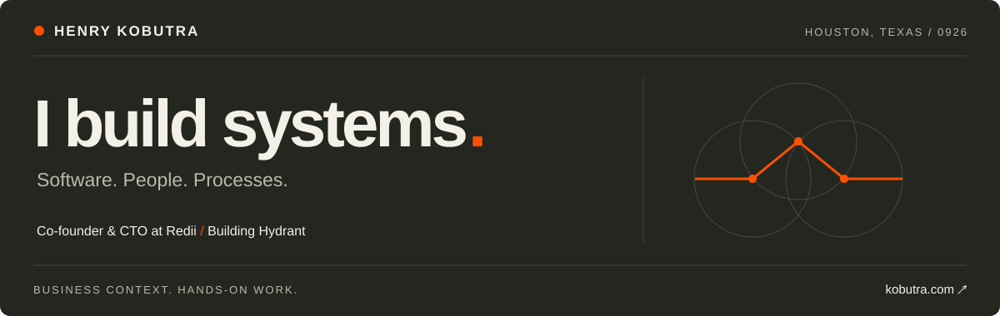

**Systems builder · Co-founder & CTO at Redii · Building Hydrant**

I work across business and technology, designing how software, people, and processes fit together. Based in Houston, Texas.

## What I'm building

- **[Redii](https://www.redii.co/)** — Software that helps companies offer and manage benefits for global teams. I'm the co-founder and CTO, working on the platform behind benefits administration and international programs.
- **[Hydrant](https://hydrant.dev/)** — An issue tracker for builders and their agents. Capture work, connect blockers, and work from the same context.

## How I work

I want to understand what a system needs to do, then stay close enough to the implementation to know whether it does it. I work with AI agents every day: deciding what to delegate, setting boundaries, and checking the result.

Before Redii, I was Director of Product at Mayan, SVP and Head of Digital Business Innovation at Principal's Thailand business, and VP of Digital Business Strategy at TISCO.

## Notes

I write practical guides about building systems, reviewing agent work, and making engineering decisions.

- [How to check an agent's work before accepting it](https://www.kobutra.com/notes/check-an-agents-work/)
- [A small patch can fix the wrong place](https://www.kobutra.com/notes/review-the-change/)
- [Give coding agents the same project context](https://www.kobutra.com/notes/shared-project-context/)

[All notes →](https://www.kobutra.com/notes/) · [Tools I use →](https://www.kobutra.com/uses/)

## Education & certifications

I hold an **MBA in IT Management** and a **BS in Information Technology** from Western Governors University.

Selected active certifications: **CPTS · PNPT · CEH · PMP**.

---

[Website](https://www.kobutra.com/) · [LinkedIn](https://www.linkedin.com/in/henrykobutra)

<!-- Hello, fellow source reader. The interesting part is how the pieces fit together. -->
